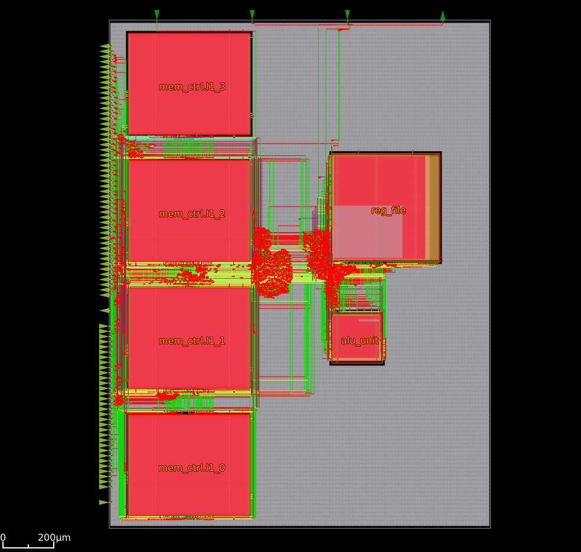
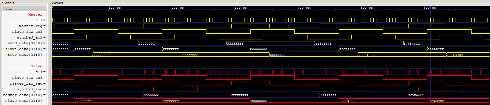

# Mamba CPU Core

This repo contains the Verilog source code for the "Mamba CPU core" which is a custom 32-bit CPU. Using OpenLane2 and Sky130 PDK, the CPU can be synthesized and placed into an ASIC design flow. The CPU is designed to be simple and expandable.



## Memory Controller

The CPU has a memory controller which features an L1 cache powered by an LRU page eviction algorithm. The communication between CPU and memory is doing using a custom protocol which supports crossing clock domains (CPU + RAM can run on different clocks). There is a unique memory address for each word (not the traditional byte indexing). The L1 cache supports four pages (which are 256 words each). 



## Simulation

### Assembler
Given that this is a fully custom CPU, the assembler is also custom. The assembler takes custom assembly code format and converts it into machine code.

Example:
```
## Area of triangle generator

### Initialize variables
# Length of the base
R0 = 20
# Length of the height
R1 = 30
# Address of the area in memory
R4 = 256
# Shift value for division by 2
R5 = 1

### Execute
R2 = R0 * R1 # Calculate area
R3 = R2 >> R5 # Divide by 2

### Store results
[R4 + 0] = R3 # Store value of R3 in address R4 (256)

### Cleanup
# Flush the L1 cache and write to memory so the simulator can see the changes in main memory
FLSH
HLT
```

To use the assembler, you can use the following command:
```bash
make assemble ARGS="tri_area.asm"
# tri_area.bin will be generated
```

### Simulator
The simulator is a custom CPU simulator that can run the machine code generated by the assembler. It supports printing the final RAM state and displaying the RAM in a grid format.

Example:

```bash
# Run the simulator indicating the ram address to print at the end
make cpu_simulator ARGS="--print-final-ram 256 1 ./tri_area.bin"
```

### More Examples

For more examples, check the [README](examples/README.md) in the examples folder.

## VLSI Flow

VLSI development requires openlane2. The easiest way to install it is by cloning the repo and enabling the nix-shell. The nix-shell will install all the dependencies and set up the environment for you.

```bash
git clone https://github.com/efabless/openlane2
cd openlane2
nix-shell
```

To synthesize the designs and run the place and route, you can use the following command:

```bash
make vlsi_cpu_core
```

Once it finishes, it can be visualized in KLayout with
```bash
make vlsi_view_cpu_core_klayout
```

## Future work
Future work includes:
 - Adding more instructions to the CPU
    - Adding a floating point unit (FPU)
    - Adding more math instructions (sin, division, modulus)
    - Adding a pseudo-random number generator (PRNG)
 - Memory improvements
    - Using more standard RAM protocol (DDR)
    - Dirty page tracking
    - L2 cache
 - Adding multiple cores

## Instruction Set

Mamba CPU instruction set.

| Name     | Opcode     | Type  | Description                       |
|----------|------------|-------|-----------------------------------|
| OP_NOP   | 5'b00000   | R0    | No Operation                      |
| OP_MV    | 5'b00001   | R1    | r1 = r2                           |
| OP_IMM   | 5'b00010   | R1I   | r1 = imm                          |
| OP_ADD   | 5'b00011   | R3    | r1 = r2 + r3                      |
| OP_ADDI  | 5'b00100   | R2I   | r1 = r2 + imm                     |
| OP_SUB   | 5'b00101   | R3    | r1 = r2 - r3                      |
| OP_SUBI  | 5'b00110   | R2I   | r1 = r2 - imm                     |
| OP_AND   | 5'b00111   | R3    | r1 = r2 & r3                      |
| OP_OR    | 5'b01000   | R3    | r1 = r2 \| r3                     |
| OP_XOR   | 5'b01001   | R3    | r1 = r2 ^ r3                      |
| OP_NOT   | 5'b01010   | R2    | r1 = ~r2                          |
| OP_SHL   | 5'b01011   | R3    | r1 = r2 << r3                     |
| OP_SHR   | 5'b01100   | R3    | r1 = r2 >> r3                     |
| OP_MUL   | 5'b01101   | R3    | r1 = r2 * r3                      |
| OP_LDO   | 5'b01110   | R2I   | r1 = [r2 + imm]                   |
| OP_STO   | 5'b01111   | R2I   | [r2 + imm] = r1                   |
| OP_JMP   | 5'b10000   | R0I   | pc = imm                          |
| OP_JR    | 5'b10001   | R1I   | pc = r1 + imm                     |
| OP_BEQ   | 5'b10010   | R2I   | if (r1 == r2) pc = imm            |
| OP_BNE   | 5'b10011   | R2I   | if (r1 != r2) pc = imm            |
| OP_BZ    | 5'b10100   | R2I   | if (r1 == 0) pc = imm             |
| OP_BNZ   | 5'b10101   | R2I   | if (r1 != 0) pc = imm             |
| OP_HLT   | 5'b10110   | R0    | Halt                              |
| OP_FLSH  | 5'b10111   | R0    | Flush                             |
